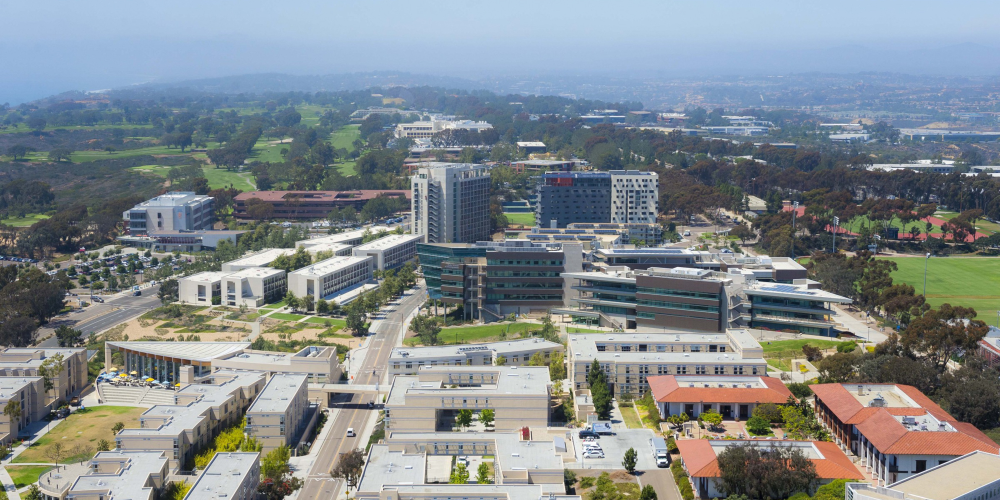

# Welcome to Mike Dong's Github Page
>Do not go where the path may lead, go instead where there is no path and leave \
a trail. -Ralph Waldo Emerson


## About me 
I am a **Math&CS and DSC** double major student from **Orange, California**, \
currently  attending USCD for undergraduate. I like to solve problems involving \
algorithms and data structures. My main programing language is **Java** and \
**Python**. Click here for my [Contact Information](#contacts) if you are interested.


## Links

This is the link to my [GitHub Pages](https://miked-source.github.io/CSE110/)

## Skills
* C++
* Java
*Python
*The frame work I most familiar with: 
*Some experiences with Node.js, some simple staff:
```
var http = require('http');
http.createServer(function (req, res) {
  res.writeHead(200, {'Content-Type': 'text/plain'});
  res.end('Hello World!');
}).listen(8080);
```
## Contacts 
* School Email: c1dong@ucsd.edu
* Phone: 626-623-0805
* Main Email: chenmiked17@gmail.com
* GitHub: https://github.com/MikeD-source

## My future goals
- [x] Meet more people who share the same interests.
- [ ] Graduate from UCSD and get a job.
- [ ] Become a better programmer.


## Facts about me

1. I was born in China, and moved here during my 1st year of middle school.
1. I was interested in CS due to my love of video games.
 1. I am a hardcore Pokemon fan.
1. When I got into UCSD, I start with a Junior standard, it was later I decide \
to stay in school a little longer and took the double major.


